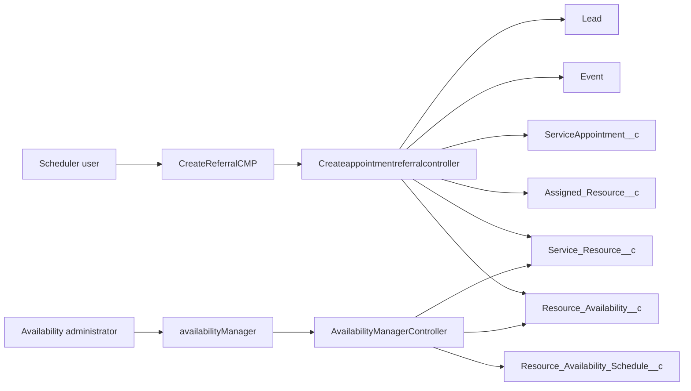
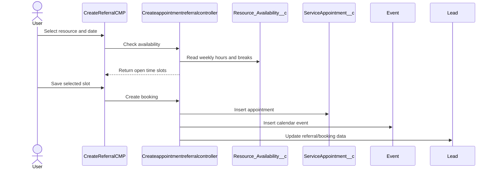
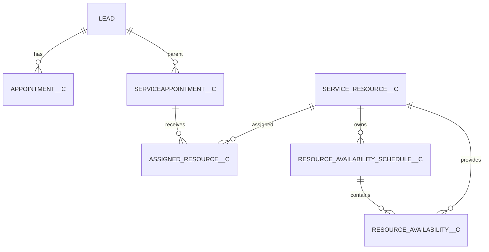

# Architecture

## Overview

The application is an Aura/Apex scheduling implementation backed primarily by custom objects. `CreateReferralCMP` provides appointment booking and calls `Createappointmentreferralcontroller`. `availabilityManager` provides weekly resource availability administration and calls `AvailabilityManagerController`.

## Booking workflow

1. `CreateReferralCMP` receives record context and booking inputs.
2. Lookup helper components select a `Service_Resource__c`.
3. `Createappointmentreferralcontroller` reads weekly availability and existing appointments.
4. The controller creates a `ServiceAppointment__c`, an Event, and an `Assigned_Resource__c`, and updates the related Lead.
5. Active flows synchronize appointment data and ownership to Lead records.

## Doctor/resource allocation

Doctors or schedulable staff are represented by `Service_Resource__c`, linked to a Salesforce User through `RelatedRecordId__c`. `Assigned_Resource__c` joins a resource to `ServiceAppointment__c`. Availability is held by `Resource_Availability_Schedule__c` and its daily `Resource_Availability__c` rows.

## Tracking and rescheduling

- `AppointmentTracking` invokes `AppointmentTrackingHandler` after a `ServiceAppointment__c` update. It increments Lead reschedule and DNA counters.
- `AppointmentReschedule` invokes `AppointmentRescheduleHandler` after an Event update. It increments the related Lead reschedule counter when the start time changes.

## Object model

