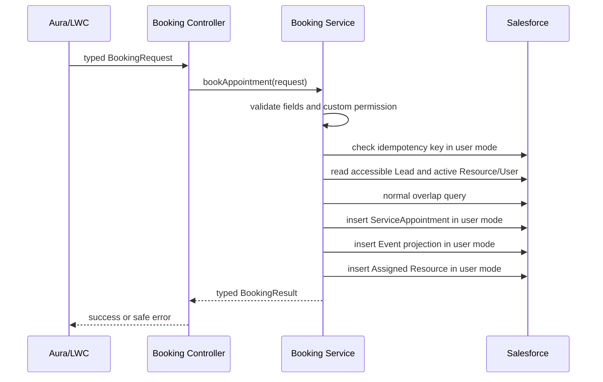

# LadminAI Appointment Booking Service Design

## Gate 2 scope

Gate 2 adds a secure transactional path for the existing scheduler. It does not add slot recommendations, a locking ledger, lifecycle enforcement, online booking, messaging, AI, payments, waitlists, or external services.

## Transaction flow

A savepoint encloses all DML. Any appointment, Event, or assignment failure rolls the transaction back and returns a safe result without internal exception details.

## Authoritative records

`ServiceAppointment__c` is authoritative for this native booking path. `Appointment__c` remains authoritative for its existing external path. Event is created only as a Salesforce calendar projection.

Gate 2 does not add the durable Event lookup or bidirectional synchronization planned for the lifecycle gate. An idempotent replay therefore returns the appointment/reference and assignment; `eventId` is populated on initial creation but may be null on replay.

## Validation

The service validates:

- Lead context and service resource identifiers;
- appointment date, start, end, and whole-minute duration from 1 to 1440 minutes;
- subject length;
- active Booked By, booking-source, and optional appointment-type picklist values;
- optional location length;
- Gate 2 creation status (`Booked`, with `Open` accepted as a compatibility alias);
- idempotency-key presence and length;
- accessible Lead;
- active service resource and active related User.

Location is optional because the retrieved working booking path has no mandatory location field.

## Security

- `with sharing` is declared on the controller and service.
- `LadminAI_Book_Appointment` is required.
- object and field access is checked before queries and DML;
- SOQL uses `WITH USER_MODE`;
- DML uses `AccessLevel.USER_MODE`;
- results contain no parent identity, email, phone, notes, stack traces, or query details;
- the booking permission set has no View All, Modify All, delete, Lead edit, or automatic assignment.

## Compatibility

The typed controller avoids the legacy positional-parameter defect. `Booked_By__c` is set on `ServiceAppointment__c` in the booking insert. The new path does not call the separate legacy `updateBookedBy` method or execute a parent adapter.

The approved `Booked` creation request maps to the existing `ServiceAppointment__c.Status__c = Open` value. Broader canonical status storage and transitions remain deferred.

## Bounded batch entry

`bookAppointments` accepts at most four requests. Each booking has its own savepoint and typed result. The deliberate bound keeps the straightforward Gate 2 implementation within savepoint, SOQL, and DML limits without introducing a generalized bulk framework.

## Remaining Gate 3 risk

The overlap query is not protected by a database lock. Two concurrent transactions can both observe an open interval and insert overlapping appointments. The unique idempotency field prevents replay of the same request key, but it cannot detect distinct requests for overlapping times. Gate 3 must add resource/date locking and recheck overlap after acquiring the lock.
