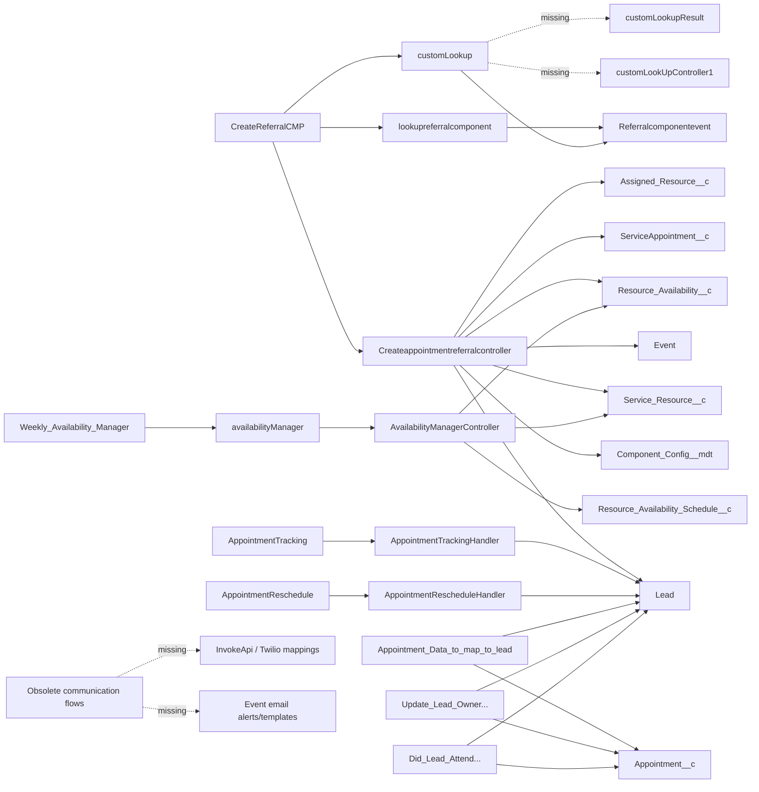

# Component Dependency Matrix

## Component graph

## Matrix

| Component | Type/status | Direct dependencies | Consumers/entry | Completeness |
|---|---|---|---|---|
| CreateReferralCMP | Aura | booking controller, 2 lookup bundles, event | Lead page/quick action/community/app page | Present; functional defects |
| availabilityManager | Aura | availability controller | Weekly custom tab | Present |
| lookupreferralcomponent | Aura | booking controller, event | CreateReferralCMP | Present |
| customLookup | Aura | missing Apex controller/result bundle, event | CreateReferralCMP | Incomplete |
| Referralcomponentevent | Aura event | none | lookup bundles/parent | Present |
| Createappointmentreferralcontroller | Apex | Lead, User, Account, Contact, Event, 4 scheduling objects, custom metadata | Aura | Present; insecure/unsafe booking |
| AvailabilityManagerController | Apex | resource and availability objects | availability Aura | Present |
| AppointmentTrackingHandler | Apex | ServiceAppointment/Lead | trigger | Present |
| AppointmentRescheduleHandler | Apex | Event/Lead | trigger | Present; bulk defect |
| AppointmentTracking | trigger | handler | ServiceAppointment updates | Present |
| AppointmentReschedule | trigger | handler | all Event updates | Present |
| Appointment_Data_to_map_to_lead | active flow | Appointment/Lead fields | Appointment after-save | Some Lead field metadata missing |
| Did_Lead_Attend_Appointment | active flow | Lead/Appointment | Lead after-save | Present |
| Update_Lead_Owner_to_Appointment_Owner | active flow | Appointment/Lead/User ownership | Appointment after-save | Present |
| Booking_Screen_Flow_Popup | active screen flow | external Calendly URLs | manual flow launch | Present; external-only |
| SDR_Booking_Screen_Pop_Up_Trigger | invalid draft flow | Lead fields | none | Non-executable |
| Changed_appointment | draft workflow flow | Event | none/current unknown | Legacy |
| 3 communication flows | obsolete | InvokeApi, Twilio mappings, Event email alerts/templates | none active | Dependencies missing |
| BookingAppointment | permission set | 5 scheduling objects/fields/tab | assigned users unknown | Present; overprivileged |
| Component_Config.appointmentBookingAura | custom metadata | CreateReferralCMP name/expiry | booking controller | Present |

## Retrieved metadata categories with no scheduling components

No LWC, Visualforce, record types, custom labels, custom settings, email templates, Named Credentials, Remote Site Settings, Lightning application, FlexiPage, permission-set group, Aura renderer, or Aura design file was present in the targeted repository.

## Missing/unclear dependencies

- `customLookUpController1`
- `customLookupResult`
- Twilio `InvokeApi` action and mapping/configuration metadata
- Event email alerts `Appointment_Booked` and `Appointment_Reminder` and their templates
- several Lead/Event/Account/Opportunity fields referenced by flows but not retrieved
- the Quick Action, FlexiPage, or app placement that launches `CreateReferralCMP`
- profiles/class access, sharing rules, guest-user access, and permission assignments
- Event custom field definitions referenced by Apex

