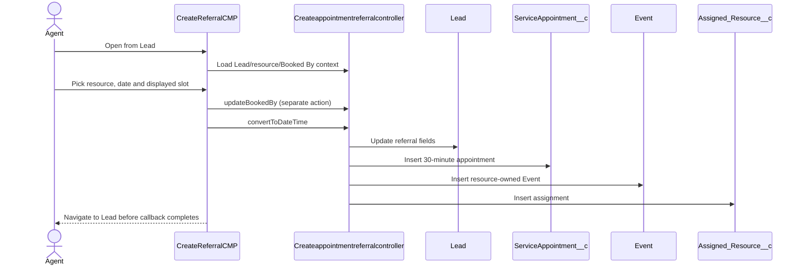
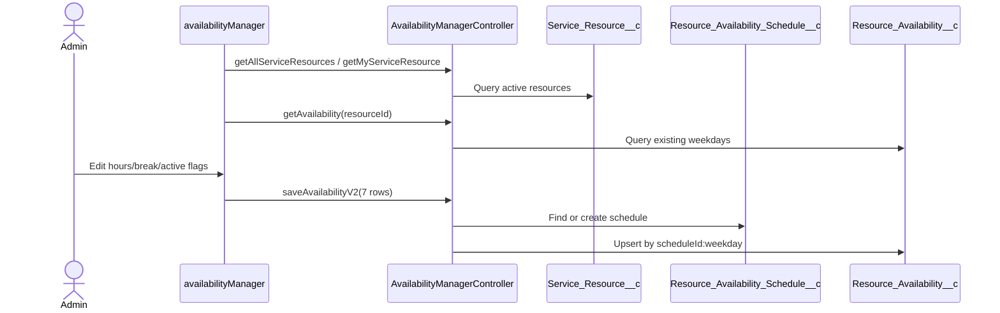
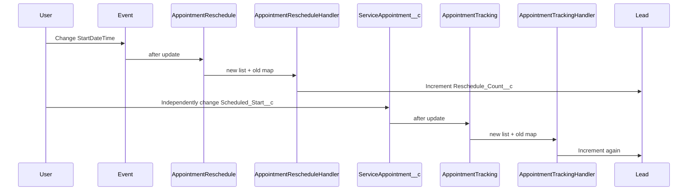

# End-to-End Process Traces

## A. Create a new appointment

- Result: intended creation of three records and Lead update.
- Validation: UI requires date/resource/one slot/booked-by; object validation may reject missing/invalid fields.
- Failure: missing source dependencies, blank status/name, time parsing, inactive related User, DML or validation. Server errors are only logged.

## B. Create/manage doctor availability

- Validation: resource required only.
- Failure: partial day upsert failures are logged but reported as overall success.

## C. Find available slots

1. Agent chooses resource and date.
2. Aura calls `availableStartTimeSlot`.
3. Apex derives weekday in the running user’s context.
4. Apex queries active availability for that resource/day.
5. A loop emits 30-minute intervals and removes break overlaps.
6. Aura displays returned rows.

Important: existing appointments are not queried in this method, so “available” means “inside working hours,” not “unbooked.”

## D. Assign a doctor/service resource

1. Agent selects `Service_Resource__c` via custom lookup.
2. Booking resolves its related active User.
3. Event owner becomes that User.
4. `ServiceAppointment__c.Service_Resource_Name__c` stores only the resource name.
5. `Assigned_Resource__c` stores the durable appointment/resource relationship.

There is no skill, location, workload, preference, anonymous assignment, or optimization logic.

## E. Reschedule an appointment

No metadata synchronizes Event and custom appointment. If both are updated, the Lead may count one real reschedule twice.

## F. Cancel an appointment

- Available data: `ServiceAppointment__c.Status__c = Cancel` and `Cancellation_Reason__c`.
- Missing process: no cancellation UI/service/flow/trigger was retrieved.
- Expected but unimplemented steps: validate policy, update paired Event, mark/release slot, notify patient/resource, audit actor/reason.

## G. Update appointment status

- Direct `ServiceAppointment__c` status changes to DNA invoke the tracking handler and increment Lead DNA count.
- Appointment/Lead active flows maintain a separate `Appointment__c.Appointment_Status__c` model.
- Event status is populated only at booking.
- No canonical state transition rules prevent invalid or contradictory statuses.

## H. Send appointment communication

- Retrieved flows describe Twilio SMS and Event email alerts for booking/reminder timing bands.
- All three communication flows are obsolete.
- `InvokeApi`, Twilio mapping records, Event email alerts, and templates are missing.
- Therefore communication is referenced but not confirmed operational.

## I. Booking errors/unavailable slots

- Missing date: toast.
- Missing values/resource: generic toast.
- Zero selected slots: toast.
- Multiple selected slots: toast.
- Apex slot query error: console only.
- Booking DML error: console only; user is already navigated away.
- Already-booked slot: not detected.
- Partial availability upsert: server logs errors while UI shows success.

