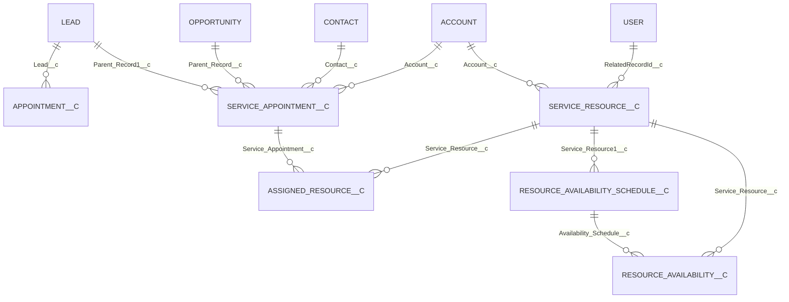

# Object Model

## Entity relationship diagram

## Domain objects

### `Appointment__c` — Appointment

Calendly-oriented appointment summary and automation record. Important fields: date/time, status, type, Lead, closer, booked by, Calendly ID, confirmation and confirming SDR. Active flows copy latest appointment data to Lead and update ownership/attendance. One validation requires `Confirmed_By_SDR__c` when confirmed. This object is separate from `ServiceAppointment__c`.

### `ServiceAppointment__c` — Service Appointment1

Primary native booking record. Important fields include scheduled/actual dates, status, booking source, booked by, subject, Lead/Opportunity/Account/Contact parents, resource name, contact details, cancellation reason, and anonymous-booking flag. The booking controller creates it; tracking trigger watches scheduled start and DNA status. Sharing model is ReadWrite internally and Private externally, but the permission set grants Modify All.

### `Service_Resource__c` — Service Resource1

Schedulable doctor/staff representation. Key fields: active, related User, Account, resource type, main flag. Used by booking and availability controllers. No specialty or location field is retrieved.

### `Assigned_Resource__c` — Assigned Resource1

Join between a service appointment and resource. `Service_Appointment__c` is master-detail; resource is lookup. Created during booking. Role/required-resource fields exist but are not populated by current code.

### `Resource_Availability_Schedule__c`

Parent schedule per resource. Only explicit field is resource lookup. Code assumes at most one schedule per resource; metadata does not enforce uniqueness.

### `Resource_Availability__c`

Weekly day availability. Fields: weekday, start/end, break start/end, active, schedule, resource, and external key. Touched by availability UI and slot generator. No exception date, effective period, time zone, capacity, or location.

### `Mapping__c`

Generic mapping container with long-text `Detail__c`. No retrieved scheduling code references it. It may support an external/integration framework and is best classified as discovered-by-name but unconfirmed.

### `RequestResource__c`

Generic HTTP request configuration object with URL, method, headers, parameters, body, timeout, authentication, username, and password fields. No retrieved scheduling component references it. Storing credentials in normal fields would be unsafe; no records were retrieved.

## Supporting metadata

- `Component_Config__mdt`: component name and expiry datetime; record `appointmentBookingAura` points to `CreateReferralCMP`.
- Lead extensions: Booked By, DNA count, creation platform, referral subject/details, reschedule count.
- Event extensions: referenced `start_date_time__c`, `End_Date_Time__c`, and `Status__c`; their field definitions were not present in the retrieved source despite manifest intent.

## Status/date/resource comparison

| Object | Status | Dates | Resource/location |
|---|---|---|---|
| Appointment__c | Booked, Attended, No Show, Cancelled | `Appointment_DateTime__c` | closer/SDR only; no location |
| ServiceAppointment__c | Arrived, Cancel, No Show, Open, DNA | scheduled/actual/arrival/due fields | resource name text plus assignment; address only |
| Event | org-specific status field referenced | standard start/duration plus text mirrors | OwnerId is doctor User |
| Resource availability | active flag | weekday/time/break | resource lookup; no location |

## Security considerations

Scheduling objects can contain contact, email, phone, address, referral details, service notes, and appointment information. These may constitute personal or special-category health-adjacent data. Access should be least-privilege, audited, and encrypted according to organizational policy. The retrieved permission set is materially broader than that standard.

