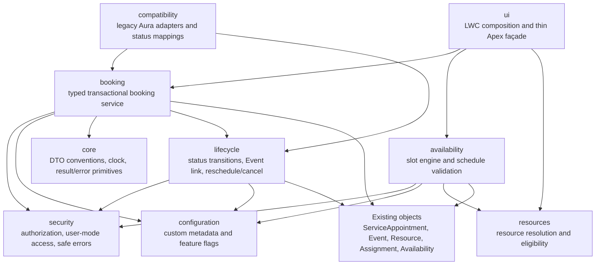
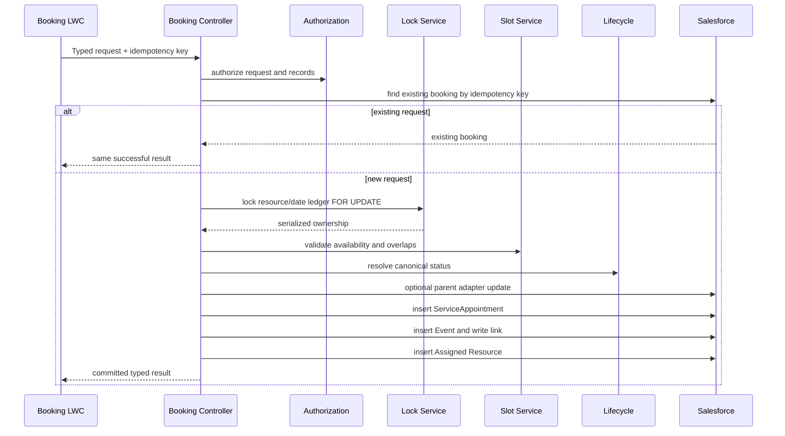

# LadminAI Appointment — Phase 0 Target Architecture

## Architectural principles

- Preserve existing object API names and subscriber data.
- Add product-owned metadata without hard-coded namespace references.
- Keep domain rules in Apex services, not UI controllers.
- Treat all booking writes as one transaction.
- Serialize conflict checks before inserting an appointment.
- Make configuration metadata-driven and Harley-neutral.
- Enforce sharing, CRUD, FLS, custom permissions, and safe errors server-side.
- Retain legacy components behind explicit compatibility boundaries.
- Keep the first commercial release in one managed 2GP; logical modules need not become separate packages.

## Logical modules



## Module ownership

### core

Shared, dependency-light primitives:

- clock/time-zone abstraction for deterministic tests;
- field-error, service-result, and safe exception conventions;
- identifier and date-range validation utilities;
- test-data factory.

Core must not depend on Harley fields, future AI, messaging, external calendars, analytics, or healthcare templates.

### booking

Owns request validation, idempotency, the atomic booking transaction, booking reference creation, Event creation policy, and assignment creation. It calls availability, resources, lifecycle, security, and configuration services.

The service returns typed results; it never exposes exception messages, stack traces, SOQL, record contents, or sensitive fields.

### availability

Owns weekly schedule validation, timezone-safe slot generation, break exclusion, active/cancelled conflict policy, booking horizon, lead time, interval, and lock acquisition. Datetime range predicates replace formatted date `LIKE` queries.

### resources

Owns active resource resolution and optional active User validation. Resource selection remains explicit in Phase 0; anonymous allocation and ranking are out of scope.

### lifecycle

Owns canonical status transitions, legacy status mapping, Event linkage, cancellation/reschedule consistency, and counter side effects. Trigger handlers delegate to this module and contain no business logic.

### security

Owns custom-permission checks, record access, CRUD/FLS enforcement, user-mode queries/DML where feasible, and `Security.stripInaccessible` where required. No profile-name authorization is allowed.

### configuration

Owns `LadminAI_Appointment_Settings__mdt` and `LadminAI_Status_Mapping__mdt`. Defaults are safe and product-neutral. Configuration lookup is centralized and test-overridable.

### ui

Owns modular LWC presentation and a thin Apex façade. UI components do not directly construct records or determine authorization. The parent orchestrator owns step state; children emit semantic events.

### compatibility

Contains adapters for Lead-specific updates and legacy Aura entry points. Compatibility code may depend on Harley-era objects/fields; core product modules may not depend on compatibility.

## Transaction design



All DML is in the request transaction. An unhandled internal failure rolls back all writes; the façade catches only at the outer boundary and converts known errors to safe responses.

## Lock design

Use one `LadminAI_Booking_Lock__c` row per service resource and resource-local service date. `Resource_Date_Key__c` is a deterministic unique external ID. The transaction:

1. derives resource-local date from the requested start and configured timezone;
2. gets or creates the ledger row, handling a duplicate insert by re-querying;
3. queries the ledger `FOR UPDATE`;
4. re-queries overlapping active appointments after the lock;
5. inserts the booking in the same transaction.

This design serializes all bookings that could overlap for a resource/date, while allowing different resources or dates to proceed independently. Cross-midnight appointments lock both involved dates in sorted key order to prevent deadlocks.

Salesforce unit tests cannot produce perfect simultaneous transaction races. Tests will prove lock acquisition, overlap checks, duplicate-key handling, adjacent slots, cross-resource behavior, and retryable lock errors; a development-org concurrency harness remains necessary.

## LWC hierarchy

```text
ladminAiAppointmentBooking
├── ladminAiResourceSelector
├── ladminAiDateSelector
├── ladminAiSlotPicker
├── ladminAiBookingSummary
├── ladminAiBookingResult
└── ladminAiErrorPanel

ladminAiAvailabilityManager
└── ladminAiAvailabilityDayEditor (one per weekday)
```

The booking parent owns request state, request token, submission guard, refreshed alternatives, focus movement, and screen-reader announcements. Child components are reusable and contain no record DML.

## 2GP directory strategy

Use a single default package directory, planned as `ladminai-appointment`, containing only product-owned and approved compatibility metadata. Preserve `force-app` as the retrieval/reference directory until Gate 8 classifies and moves or excludes every component.

Proposed `sfdx-project.json` direction:

```json
{
  "packageDirectories": [
    {
      "path": "ladminai-appointment",
      "default": true,
      "package": "LadminAI Appointment",
      "versionName": "Phase 0",
      "versionNumber": "0.1.0.NEXT"
    },
    {
      "path": "force-app",
      "default": false
    }
  ],
  "namespace": ""
}
```

No package alias, namespace, package ID, or version is created in Phase 0 without explicit authorization.

## Legacy boundary

| Component | Phase 0 disposition |
|---|---|
| `CreateReferralCMP` | compatibility; retained until new LWC is validated |
| `Createappointmentreferralcontroller` | compatibility; new UI must not call it |
| `availabilityManager` | compatibility; retained until Gate 6 validation |
| `AvailabilityManagerController` | compatibility; replaced by validated service |
| `customLookup` | missing dependency; exclude from commercial package unless repaired |
| `Booking_Screen_Flow_Popup` | Harley-specific/external; exclude from reusable core |
| obsolete communication flows | exclude from core; do not delete from Harley |
| current triggers | retained, then narrowed and delegated in Gate 4 |
| `BookingAppointment` | compatibility only; not a product persona permission set |
