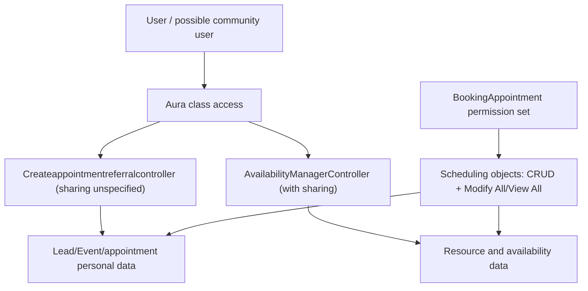

# Security Review

Documentation-only static review; no penetration test or org permission evaluation was performed.

## Findings

| Severity | Finding | Evidence and impact |
|---|---|---|
| Critical | Permission set grants full control | `BookingAppointment` grants create/read/edit/delete, View All, and Modify All on five scheduling objects and edit access to sensitive fields. Compromise/misassignment enables bulk disclosure or destruction. |
| High | No CRUD/FLS enforcement in Aura Apex | Controllers query and mutate sensitive objects/fields without user-mode operations or `stripInaccessible`. Class access can bypass intended field-level restrictions. |
| High | Global/community-capable Aura exposure | `CreateReferralCMP` and `customLookup` are global and community-available. Guest/public exposure cannot be confirmed because profiles/site metadata are missing; if enabled, Lead and appointment data could be exposed or modified. |
| High | Record sharing not explicitly enforced by booking controller | `Createappointmentreferralcontroller` does not declare `with sharing`. |
| High | Credential-shaped custom object | `RequestResource__c` has plaintext username/password/authentication fields. No records were retrieved, but using it for secrets would create disclosure and audit risk. |
| High | Communication confidentiality unverified | Legacy Twilio/email flows reference missing actions/templates/mappings; consent, recipient validation, message minimization, and delivery audit cannot be assessed. |
| Medium | Component expiry fails open | Missing/broken config returns not expired, so a kill switch cannot reliably revoke access. The UK-time conversion also compares shifted datetime values incorrectly. |
| Medium | Booking source anti-tampering comment is ineffective | `component.set(value, component.get(value))` does nothing; server trusts submitted booking source/status. |
| Medium | Broad data returned to client | Resource lists and availability are returned without explicit FLS checks; resource visibility depends on sharing/class access. |
| Medium | Sensitive values in debug/browser logs | DML errors and payload information are logged; production debug logs may expose identifiers or business data. |
| Medium | Data minimization and retention unspecified | Service appointment schema includes email, phone, address, referral/service notes with no evidenced retention, masking, or consent controls. |
| Low | Dynamic SOQL | `setObjectToRecentItems` uses a type derived from a valid record ID and a bound ID, so injection risk is low, but authorization/error behavior is uncontrolled. |
| Low | Hard-coded business values/URLs | Clinic subject, Europe/London, Calendly URLs, Twilio mapping names, and picklist assumptions are org-specific and difficult to govern. |

## Sharing and access model

## Hard-coded and missing controls

- No hard-coded Salesforce record IDs or credentials were found.
- Hard-coded clinic wording, time zone, 30-minute duration, external booking URLs, statuses, and integration action names exist.
- Profiles, permission-set assignments, guest-user access, sharing rules, Apex class permissions, Experience Cloud configuration, email templates/alerts, Named Credentials, and integration mappings are missing, preventing full authorization verification.
- Anonymous allocation has no controls because it is not implemented.

## Privacy assessment

Lead/contact identity, email, phone, address, referral subject/details, appointment timing/status, no-show counts, and service notes can reveal sensitive healthcare context. Risks include excessive internal access through Modify All, community exposure if class/component access is granted, unverified SMS/email recipients, and debug-log retention.

## Potential privilege escalation paths

1. A user receives `BookingAppointment` and gains Modify All/delete across appointment/resource/availability records.
2. A user with Aura Apex class access invokes methods directly with another Lead/resource ID; server-side CRUD/FLS and ownership authorization are absent.
3. If community guest access includes these classes, public callers may enumerate active resources or attempt booking mutations.

No exploit was attempted.

