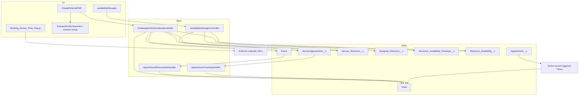

# Technical Design

## System architecture

## Apex classes

### `Createappointmentreferralcontroller`

- Sharing: inherited/unspecified (`public class`), effectively not declaring record-sharing enforcement.
- Aura methods:
  - `isComponentExpired(String) -> Boolean`
  - `getLeadName(String) -> String`
  - `convertToDateTime(...) -> Lead`
  - `getUserName() -> String`
  - `getPiklistValues1(String) -> String`
  - `setObjectToRecentItems(Id) -> void`
  - `availableStartTimeSlot(String, Date) -> List<List<String>>`
  - `returnAccountName(String) -> String`
  - `fetchContactEmail(String) -> String`
  - `getInhouseCreatedBy(Id) -> String`
  - `getBookedByPicklistValues() -> List<String>`
  - `getBookedByValue(Id) -> String`
  - `updateBookedBy(Id,String) -> void`
- SOQL: custom metadata, Lead, active resources and related Users, same-day appointments, selected resource/User, availability, Account, and Contact.
- DML: updates Lead; inserts `ServiceAppointment__c`, Event, and assignment; dynamically queries a recent item.
- Bulkification: most methods are single-record UI operations. `convertToDateTime` queries all active resources and all date-matching appointments; it is not designed for bulk calls.
- CRUD/FLS: no `WITH USER_MODE`, `Security.stripInaccessible`, describe authorization, or object permission checks.
- Error handling: mostly unhandled; component expiry catches everything and fails open.
- Defects/risks:
  - appointment collision map is built but never consulted;
  - date filtering uses formatted text with `LIKE`;
  - method parameters `emailAddress` and several local maps are unused;
  - JS does not pass `leadName`;
  - status is set to `Scheduled` then overwritten;
  - separate Lead update and booking call can leave partial state;
  - no savepoint/rollback or structured error response;
  - Event and custom appointment have no durable relationship;
  - `Datetime.parse` and `.format()` are user-locale/time-zone dependent;
  - dynamic SOQL is type-derived and ID-bound, limiting injection risk, but `FOR VIEW` may still fail by object type.

### `AvailabilityManagerController`

- Sharing: `with sharing`.
- Methods: list resources, find current user’s resource, get availability, save availability, parse time.
- SOQL: maximum four queries per save; list retrieval capped at 200.
- DML: optional schedule update/insert and one partial-success upsert.
- Bulkification: adequate for seven day rows, not an API-scale service.
- CRUD/FLS: absent.
- Error handling: many errors are swallowed or only debugged; partial upsert failures are not returned to UI.
- Risks:
  - any caller with class access can request/edit another resource by ID subject to sharing;
  - one schedule is assumed but uniqueness is not enforced;
  - external key is not marked unique;
  - invalid time strings become null rather than errors;
  - no semantic time validation;
  - `skipped` and success counts are never returned.

### `AppointmentTrackingHandler`

- Responsibility: increment Lead reschedule/DNA counters after `ServiceAppointment__c` updates.
- Bulk behavior: one Lead query and one update for the transaction; aggregates multiple appointments per Lead.
- Risk: read-modify-write counters can lose increments under concurrency; no FLS; no recursion guard; assumes `Parent_Record1__c` is a Lead.
- Error handling: none; Lead update failure rolls back originating appointment update.

### `AppointmentRescheduleHandler`

- Responsibility: increment Lead reschedule counter after Event start changes.
- Bulkification defect: Lead query/update is inside the Event loop. Multiple Events can cause repeated queries/DML and premature `return`; this can exceed limits and produce incorrect behavior.
- Functional risk: counts any Event linked through `WhoId`, not only scheduler-created appointments.
- Error handling/security: none.

## Test classes

| Test | Strengths | Weaknesses |
|---|---|---|
| `AppointmentTrackingHandlerTest` | reschedule, DNA, combined, bulk, no-change paths | no concurrency, invalid parent, permissions, or failure-path testing |
| `AppointmentRescheduleHandlerTest` | changed/no-change scenarios | first test manually invokes handler after trigger already ran and expects 2; multi test has no assertion; does not expose bulk SOQL/DML defect |
| `AvailabilityManagerControllerTest` | broad method and insert/update branch coverage | depends on Profile name `Standard User`; does not test FLS, partial upsert errors, duplicate schedules, invalid intervals, >200 resources |
| `CreateappointmentreferralcontrollerTest` | exercises helpers and constructs core records | largely recreates DML instead of asserting `convertToDateTime`; no collision, blank status/name, transaction rollback, time-zone, missing config, or UI-contract tests |

No repository coverage report is available; quality is assessed from assertions and paths, not percentage.

## Triggers

| Trigger | Events | Handler | Notes |
|---|---|---|---|
| `AppointmentTracking` | `ServiceAppointment__c after update` | `handleAfterUpdate` | Focused delegation and bulk-safe handler |
| `AppointmentReschedule` | `Event after update` | `handleAfterUpdate2` | Applies to all Events; handler has DML/SOQL inside loop |

## Aura bundles

| Bundle | Purpose and interfaces | Apex/event dependencies | UI/validation weaknesses |
|---|---|---|---|
| `CreateReferralCMP` | Lead-context booking; app/page/record/community/quick-action, global | booking controller; lookup bundles; component event | no server collision check; async save race; errors console-only; missing parameters; deprecated Aura |
| `availabilityManager` | weekly table; app/page, global | availability controller | no semantic time validation; table weak on mobile; debug code references nonexistent `saveAvailability` |
| `lookupreferralcomponent` | generic `lightning:inputField` lookup | booking controller `setObjectToRecentItems`; component event | assumes selected value array; limited error handling |
| `customLookup` | typeahead resource lookup | **missing** `customLookUpController1`; **missing** `customLookupResult`; component event | cannot be reconstructed/deployed from current repository |
| `Referralcomponentevent` | passes record ID/sObject | used by lookups and parent | loosely typed, dual-purpose payload |

No renderer or design files were retrieved.

## Flow design

| Flow | Type/status/launch | Behavior | Fault handling and dependencies |
|---|---|---|---|
| `Appointment_Data_to_map_to_lead` | after-save Appointment create/update; Active | checks latest appointment, updates Lead booking/date/status/type/closer/confirmation fields | no fault connectors; references Lead fields not all retrieved |
| `Booking_Screen_Flow_Popup` | screen flow; Active | shows four hard-coded external Calendly links | no record work or error handling |
| `Did_Lead_Attend_Appointment` | after-save Lead update; Active | maps certain Lead stages to Appointment status `Attended` | no fault path; exact target association requires metadata context |
| `Update_Lead_Owner_to_Appointment_Owner` | after-save Appointment create/update; Active | gets Lead and assigns owner from appointment closer | no fault connector |
| `SDR_Booking_Screen_Pop_Up_Trigger` | Lead after-update; InvalidDraft | criteria: Status changed to Qualified and Service Type not Dermatology | invalid and non-executable |
| `Changed_appointment` | legacy workflow process; Draft | detects Event start change | draft; obsolete workflow representation |
| `Send_Appointment_Booked_SMS` | legacy workflow flow; Obsolete | branched/timed Twilio SMS and Event email alerts | missing `InvokeApi`, mappings, email alerts/templates; no reliable fault path |
| `Send_Appointment_Booked_SMS_1` | Event after-create; Obsolete | 24/72-hour communication branching | same missing dependencies |
| `Send_Appointment_Reminder_SMS` | legacy workflow flow; Obsolete | timed reminder SMS | missing Twilio action/mapping |

## Transaction boundaries

The booking method executes Lead update, appointment insert, Event insert, and assignment insert in one Apex transaction, so an unhandled later exception normally rolls back earlier DML. However, `updateBookedBy` is invoked as a separate Aura action, allowing the Lead to change even when booking fails. Client navigation is also not synchronized with server success.

## Observability

Only `System.debug`, browser console logging, and toasts are present. There is no structured log object, correlation ID, platform event, error telemetry, or operational dashboard.

